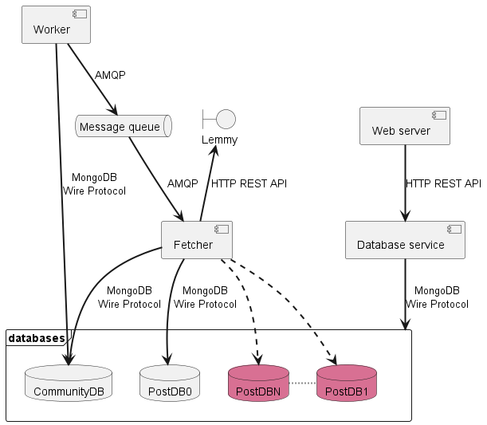
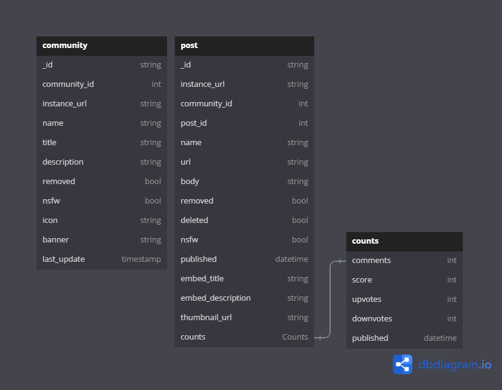

# Lemmy Fetcher
## Project description
The idea behind this project is to set up a structure where data is periodically updated from an external source. In this specific case, I use Lemmy posts as an example, however, this could be generalised to other application, such as shipment tracking or price tracking software.

Lemmy is a decentralized federated version of Reddit, with different instances communicating with each other. Each instance has a number of communities, often grouped based on topics, e.g. technology, politics, games. Each community has posts posted by users. Because of the federation, each instance provides a standardised api to fetch information. The API reference for Lemmy can be found [here](https://join-lemmy.org/docs/index.html).

The idea for this application is that the user adds a community that they want to track through the web interface. There is then a worker that regularly polls the database for any communities that needs updating, which then puts a message on a queue that a fetcher reads from, which then is responsible for getting the new data from the Lemmy api.

## Architecture
### Overview

### Database 

These are the fields used by the database service. Other fields may exist on each object.

### Worker
The worker is responsible for polling the community database, looking for any community that needs to be updated. This is decided by looking at the last_update field and comparing it to a configurable refresh rate. The polling is done through exponential backoff in order to not overload the database when there is little work to do, but to still be efficient when the workload is high. There is also a configurable batch size, which decides how many documents are fetched on each iteration. For each document that shoud be updated, a message with the object id is added to the queue. 

### Message queue
The message queue uses RabbitMQ, which implements the Advanced Message Queuing Protocol (AMQP) and is easily deployed with kubernetes. The queue acts as a buffer between the worker and the fetcher, as a means to decouple them and make them indepentently scalable, as well as making sure that the messages don't get lost if the fetcher goes down.

### Fetcher
The fetcher reads messages from the queue. It uses the AMQP basic_consume command to get the queue messages delivered to it. It then begins by updating the community, after checking that it has not been removed from the database in the time between being added to the queue and the fetcher worker consuming the messsage, and then it fetches the last 20 posts from the community and saves them in the posts database.

### Database service
The database service acts as an API between the back end and the front end systems. The main use of the database service is for the front end to get data to and from the databases. The backend systems communicate directly with the databases, instead of using the database service. The database service provides a REST api using json for serialization. The fields that are sent are the ones presented in the database overview.

In the future, you might imagine that the backend services also uses the database service, especially if you wanted to manually implement sharding of the post databases, more on that later...

You can also imagine there being several different frontends that uses the database service.

### Web server
The webserver is a simple website that uses server side rendering to display content to the user. On the website it is possible to add and remove communities, as well as browse the added communities. It uses the database service for its communication with the database.

### CommunityDB
This is the database that is responsible for storing all of the information about the communities that are folowed. The idea is that this database can be replicated, but will not be sharded, since this database should not contain *too* much data, and the amount of data will not grow without user interaction.

When you add a community to the database, it will only have the instance url and the name, the rest of the fields will be populated by the fetcher service.

### PostDB
This is the database for storing the posts. Since there are more posts than communities, this database will contain more data. Therefore, the idea is to shard this database based on the communityId, in order to split the load between the databases.

## Benefits, Challenges, and where to go next
