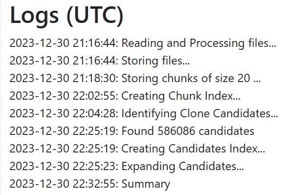
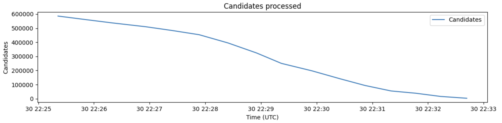
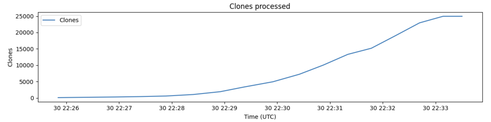

# Introduction
All changes to cljdetector have been marked with a comment beginning with `CHANGED:`. All of the analysis done in Question 2 is for the unoptimized version.

# Question 1
With the original cljdetector program, I was unable to process the entire corpus, due to a bug in the program. When iterating over the files in the corpus, it would match any file with the pattern `*.java`. The problem arose with some of the code-bases having directories named with the same pattern e.g. `jellytools.java` in the `netbeans` repository. This caused the file processing to silently fail when trying to read a directory as a file, resulting in only 2100 files read. After fixing that bug, I was able to process the entire data set in ~6.5 hours.


## Optimizing
When writing the answer to the question regarding the generate candidates question, I realized that the queries used in the program might be helped by adding a few indexes.

The first index is for the identify-candidates pipeline, where a index for chunkHash in the chunks collection is created. This allows the group with the chunkHash-key to use the index, reducing the complexity from O(n) to O(log n) (with a base of 8192 according to [this](https://stackoverflow.com/a/25921398) stack overflow answer). Accounting for the time to create the index, this reduced the time from 3.5 hours to 22 minutes (and earlier test runs showed improvements down to about 15 minutes).

The second index is for the candidates, on the filenames for each instance in each candidate. This helps with the first match-step in the get-overlapping-candidates aggregation pipeline, allowing for faster filtering of the candidates. This improved the time from 2 hours and 20 minutes down to 7.5 minutes.

These two small (13 lines of code total) optimizations brought the total time down from ~6.5 hours to just above 1 hour 15 minutes. *me adjusts his tie and brushes off an imaginary speck of dust from his sleeve.*

# Question 2
## Collected data
### Before optimization


### After optimization



## Time to generate chunks
The number of chunks generated increases linearly with time, which indicates that the time to generate each chunk is constant. This makes sense, since the processing of chunks for one file is not dependent on the processing of chunks for the other files.

## Time to generate candidates
I cannot answer this question empirically, since all of the processing to generate candidates were done in the database, and it did not give continuous output of the results. However, reasoning about the process, we would expect theoretical time to be constant for each candidate, since we use the hash to find all the similar chunks. However, since MongoDB is not a hashtable, and since we don't have any index for the chunkHash, finding all matching chunks requires a linear search through the entire collection, resulting in the processing time for each chunk increasing linearly with the number of chunks in the database. Also, depending on how MongoDB handles the aggregate function, the time may or may not be dependent on the number of already processed candidates, depending on if MongoDB consideres already matched candidates as "consumed".

## Time to expand clone candidates
As we can see in the graph, the number of candidates decreases linearly with time, indicating that the time to process each candidate is constant. However, we can also see that the number of clones increases superlinearly, indicating that the time to find new clones decreases as the number of candidates decreases, alternatively the number of clones found for each candidate increases the more candidates are processed.

## Average clone size
```db.clones.aggregate([{$addFields: {"instance": {$first: "$instances"}}}, {$project: { length: {$subtract: ["$instance.endLine", "$instance.startLine"]}}}, {$group: {_id: 0, average: {$avg: "$length"}}}])```

The average clone size is 52.2 lines long. Since every candidate is either part of an existing clone, or considered a new clone, and we know the number of lines per chunk, we can use this to calculate progress by comparing number of lines in the found clones compared to the total number of lines in the candidates compared to the average clone size. With this we should be able to get an estimate of the total number of clones that exist. The exact calculations required are left as an implementation detail.

## Average chunks per file
```db.chunks.aggregate([{$addFields: {fileName: "$fileName"}}, {$group: {_id: "$fileName", count: { $count: {}}}}, {$group: {_id: 0, average: {$avg: "$count"}}}])```

The average number of chunks per file is 159.9 chunks. During the read phase, this does not help us very much. During the chunkify phase, we can predict progress by looking at the number of chunks added to the collection, and then dividing by average number of chunks per file to give us an estimate of how many of the files that have been processed. For the identify candidates stage, we have the same problem as above, that the aggregate command is essentially a black box that gives little insight into the progress of the command.