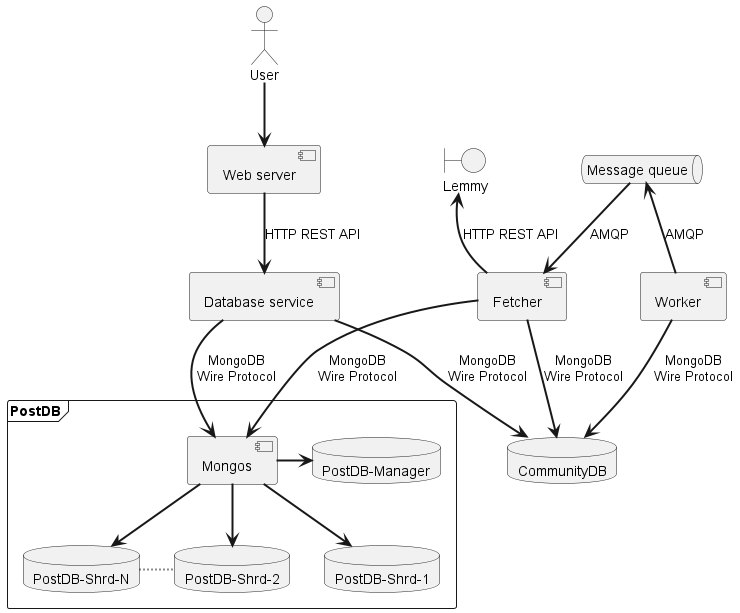
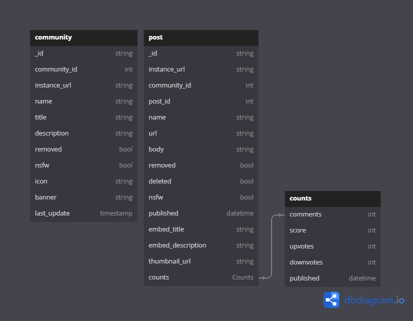

# Lemmy Fetcher

## Table of Contents
1. [Running the project](#running-the-project)
1. [Project description](#project-description)
2. [Architecture](#architecture)
3. [Benefits, Challenges, and where to go next](#benefits-challenges-and-where-to-go-next)
4. [Links](#links)

## Running the project
### Building images
Building the images and publishing them to docker hub is done with the `build.sh` file. Note that you need to change the tags to correspond to your docker hub repository to publish to the correct place. (Don't forget to change the images used in the deployment files as well!)

### Starting the cluster
Run `deploy.sh`. This will go through all the stages required to start the cluster. Deploying takes approximately 5 minutes.

#### Parameters
To modify the number of shards to deploy to the postdb database cluster, modify the `NUM_SHARDS` parameters in the `build.sh` file.

The number of replicas for each service is modified in `assignment1.yml`, except for the shard replicas, which are specified in `shard-template.yml`. Other parameters, such as log level, batch size, and update frequency is also specified in the configuration section in `assignment1.yml`.

### Cleanup
To clean up all resources, run `cleanup.sh`. This removes the entire deployment, including all persistant volumes, persistant volume claims, as well as the temporary files required for shard deployment. Cleanup takes approximately 3 minutes.

## Project description
The idea behind this project is to set up a structure where data is periodically updated from an external source. In this specific case, I use Lemmy posts as an example, however, this could be generalised to other application, such as shipment tracking or price tracking software.

Lemmy is a decentralized federated version of Reddit, with different instances communicating with each other. Each instance has a number of communities, often grouped based on topics, e.g. technology, politics, games. Each community has posts posted by users. Because of the federation, each instance provides a standardised api to fetch information. The API reference for Lemmy can be found [here](https://join-lemmy.org/docs/index.html).

The idea for this application is that the user adds a community that they want to track through the web interface. There is then a worker that regularly polls the database for any communities that needs updating, which then puts a message on a queue that a fetcher reads from, which then is responsible for getting the new data from the Lemmy api.

## Architecture
### Overview

### Database 

These are the fields used by the database service. Other fields may exist on each object.

### General
All applications run as either stateful sets or replicasets, and each application is configured to run with 3 replicas, except for the mongos server. The number of replicas for each application can be scaled independently from the rest.

### Worker
The worker is responsible for polling the community database, looking for any community that needs to be updated. This is decided by looking at the last_update field and comparing it to a configurable refresh rate. The polling is done through exponential backoff in order to not overload the database when there is little work to do, but to still be efficient when the workload is high. There is also a configurable batch size, which decides how many documents are fetched on each iteration. For each document that shoud be updated, a message with the object id is added to the queue. 

### Message queue
The message queue uses RabbitMQ, which implements the Advanced Message Queuing Protocol (AMQP) and is easily deployed with kubernetes. The queue acts as a buffer between the worker and the fetcher, as a means to decouple them and make them indepentently scalable, as well as making sure that the messages don't get lost if the fetcher goes down.

### Fetcher
The fetcher reads messages from the queue. It uses the AMQP basic_consume command to get the queue messages delivered to it. It then begins by updating the community, after checking that it has not been removed from the database in the time between being added to the queue and the fetcher worker consuming the messsage, and then it fetches the last 20 posts from the community and saves them in the posts database.

### Database service
The database service acts as an API between the back end and the front end systems. The main use of the database service is for the front end to get data to and from the databases. The backend systems communicate directly with the databases, instead of using the database service. The database service provides a REST api using json for serialization. The fields that are sent are the ones presented in the database overview.

In the future, you might imagine that the backend services also uses the database service, in order to decouple the database further.

You can also imagine there being several different frontends that uses the database service.

### Web server
The webserver is a simple website that uses server side rendering to display content to the user. On the website it is possible to add and remove communities, as well as browse the added communities. It uses the database service for its communication with the database.

### CommunityDB
This is the database that is responsible for storing all of the information about the communities that are folowed. The idea is that this database can be replicated, but will not be sharded, since this database should not contain *too* much data, and the amount of data will not grow without user interaction.

When you add a community to the database, it will only have the instance url and the name, the rest of the fields will be populated by the fetcher service.

### PostDB
This is the database for storing the posts. Since there are more posts than communities, this database will contain more data. Therefore, the idea is to shard this database based on the communityId, in order to split the load between the databases.

Sharding in MongoDB consists of three components: The configuration database, the shard databases, and a mongos server that is responsible for routing the requests.

For our application, we only have one mongos server that all the other services communicates with, but if we wanted to scale it further, each service could run its own mongos server as well, as suggested in [Performance Best Practices for MongoDB](https://www.mongodb.com/lp/white-paper/trial/performance-best-practices).

## Benefits, Challenges, and where to go next
### Benefits
The benefit of the deployed architecture is that it is very scalable, and each component can be indepentently scaled from the others. In large scale applications, the database is often the bottleneck, since it serves as the single common point that all parts of the application communicates with. By sharding the parts of the database that contain the most data, it alleviates this bottleneck by distributing the load.

The system is also quite robust against different parts of the application stopping unexpectedly and abruptly. This is mostly assured through the usage of the queue service, since if any fault should present itself in the fetcher, the message will be returned to the queue and wait until another fetcher is ready to process it. The worker can also continue to add new messages to the queue while the fetcher is down, and these will be processed once the fetcher is up again. This adds a layer of decoupling between the worker and the fetcher compared to the worker making direct requests to the fetcher.

A third benefit is that the database service provides a common interface for any front-end application that wants to access data from the application. The database service also provides api documentation through swagger that is easy to use for other developers.

### Challenges

#### Security
One of the biggest security concerns in the application is the fact that none of the databases have any authentication or authorization put in place. This is not a huge security concern for several reasons, but it is important to keep in mind.

So why is it not a security concern? Firstly, the only part of the application that is externally accessible is the load balancer for the web servers, and by extension, the web servers. Going one step further, the web server never communicates directly with the database, but instead communicates through the database service, which provides strict type checking for the api (one of the reasons to not use Python for this service). Therefore, the only concern is if a malicious actor was able to break out of the python application and get shell access, in which case they could of course connect to the databases and wreak whatever havoc they want. I can, however, not find any evidence that this is possible. Another reason that this is not currently a huge security concern, is that the databases do not currently store any sensitive information, so the worst case scenario if the database gets breached is data loss.

This can be mitigated by adding a username and password to the database, or by isolating the databases so that there is no way for the web server pod to connect directly to the database pods, either through RBAC, or network isolation.

All secrets that do exists, such as username and password for RabbitMQ, and the secret key for the web server, is stored as secrets.

Most of the other security concerns with the website lays in the web server.

The first one is that the input from the website is not validated in the back-end services. This allows a user to input invalid or malicious links into the application. There is currently no implementation for handling invalid links, so they will simply exist in the system and take up system resources. This is however quite easy to mitigate, firstly by verifying that the input is in the correct format and that the instance/community combo actually exists, secondly, by adding some kind of mechanism to remove communities that don't work from the worker's tasks, and thirdly, as a more extreme measure, by keeping a record of allowed domains.

The second security problem is XSS attacks. When showing the communities and posts on the website, images are loaded from external sources. This may allow someone to post a malicious image (as a svg) and perform an XSS attack through that image, as descibed [here](https://security.stackexchange.com/questions/135513/what-could-an-img-src-xss-do). This can be mitigated through the strategies explained [here](https://digi.ninja/blog/svg_xss.php).

The third more major security problem is the lack of CSRF protection. However, again, this is not a huge problem since we do not handle or store any sensitive data, and this could easily be mitigated by adding a CSRF token to the form, as well as defining sane CORS rules.

#### Architecture
One of the main challenges with this application is that it has quite a high complexity. A good example of this is the sharded databases, which adds a lot of complexity to the deployment and management of the service. It also adds quite a lot of overhead with the requirement of the replicated config server and the separate shards. However, this overhead is mitigated when scaling up to large scale use (hundreds of thousands to millions of communities). The only part of the application that does not support really large scaling currently is the RabbitMQ, however, this could (with some effort) also be sharded to reduce the load on each queue. You could also imagine a priority system where different communities(instances?) have different priorities for being updated, and the fetcher would not handle the lower priority queues until the higher priority queues are empty (or maybe handle them in a round robin style with time for each queue proportional to its priority?)

Also, to prevent a queue backlog to suddenly hammer lemmy instances with multiple post fetches for the same community, you could add a extra field to each community for the last time posts were fetched, and verify the last fetch time in the fetcher before fetching data.

Another tradeoff between complexity and performance is the fact that the backend system directly communicates with the database instead of going through the database service. This reduces the latency and increases the throughput, but it also increases the coupling and reduces the security, since the same input validation is not performed for the backend system as for the database service.

The performance gains compared to the increased complexity and reduced security is probably not a good tradeoff, and routing all database requests through the database service would also allow only database services to have their own mongos services, instead of each service needing its own mongos service, if we wanted to implement the recommended strategies.

Lastly, some tuning for the resource requests/limits is required, as well as tuning for the readiness probe parameters. It would also be good to add readiness/liveness probes to the fetcher/worker services, as well as the database service.

## Links
* [Github](https://github.com/vigge93-BTH-courses/PA2557-Tillampad-Cloud-Computing-och-Big-Data)
* [Docker hub](https://hub.docker.com/r/viar19/pa2577-a1)
* [Service link (once deployed)](localhost:8000)